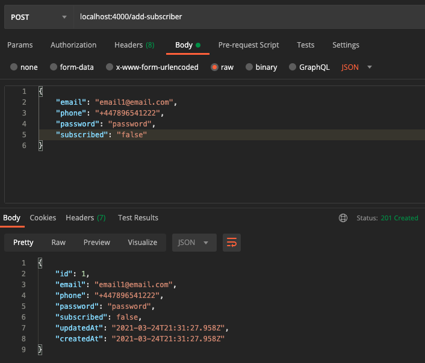
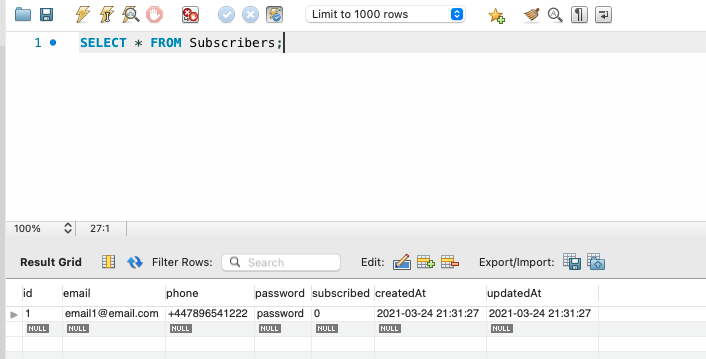
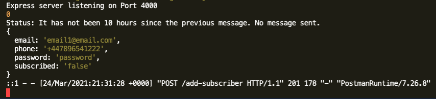
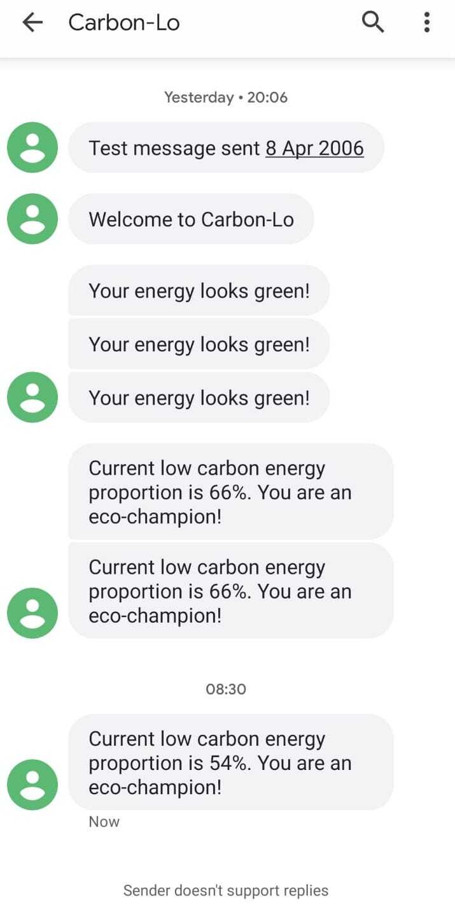

# Carbon-Lo App

## Introduction

The Carbon-Lo app uses live energy data to alert you when UK energy hits a certain low-carbon threshold. This enables you to utilise energy at its greenest and reduce your carbon footprint, at the most convenient time for you!

The app uses a third party API, provided by [Reactive Energy](https://www.reactive.energy/), to retrieve live energy data for the UK. It uses the live data to assess the proportion of energy being generated by low-carbon sources. A text message alert to subscribers is triggered when the energy proportion reaches a certain threshold. 

In the [frontend](https://github.com/jlopenshaw41/final-project), energy source (fossil fuels, low-carbon, etc) is displayed in a pie chart. Users have the option to view the chart, which refreshes every 30 minutes and subscribe to SMS alerts if they wish.

Subscriber information is held in a SQL database. The API provides create, read, update and delete (CRUD) functionality.

The text message alerts are sent using Twilio's SMS service. This is integrated with the backend API using an open-source package called [node-cron](https://www.npmjs.com/package/node-cron), to schedule and automate the sending of messages.

You can see a live deployed version of the app [by clicking here.]()

A Manchester Codes Software Engineering course final project.

## Contributors

[Jennifer Cant](https://twitter.com/niff_ellisiva), [Paul Hardy](https://github.com/iampaulhardy) and [Jen Openshaw](https://twitter.com/Jlopenshaw)

## Screenshots

Testing backend API functionality using Postman

Using MySQL Workbench during development to work with the SQL database

App running during development, showing status updates

Example SMS alerts using Twilio received during testing
## Technologies

- [Express](https://expressjs.com/)
- [MySQL](https://www.mysql.com/)
- [Sequelize](https://sequelize.org/)
- [Twilio](https://www.twilio.com/)
- [Cron](https://www.npmjs.com/package/node-cron)
- [Supertest](https://www.npmjs.com/package/supertest)
- [Chai](https://www.chaijs.com/)
- [Mocha](https://mochajs.org/)
- [Morgan](https://www.npmjs.com/package/morgan)
- [Nodemon](https://nodemon.io/)
- [Axios](https://www.npmjs.com/package/axios)

## Status

Project is: _IN PROGRESS_

## Inspiration

This project was inspired by [Reactive Energy](https://www.reactive.energy/)
